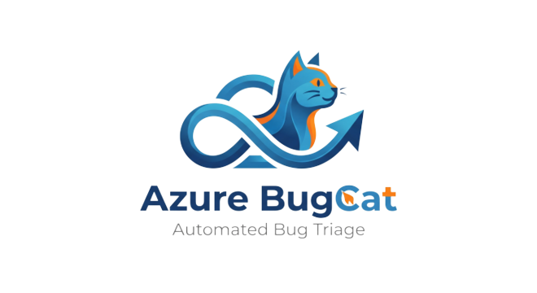
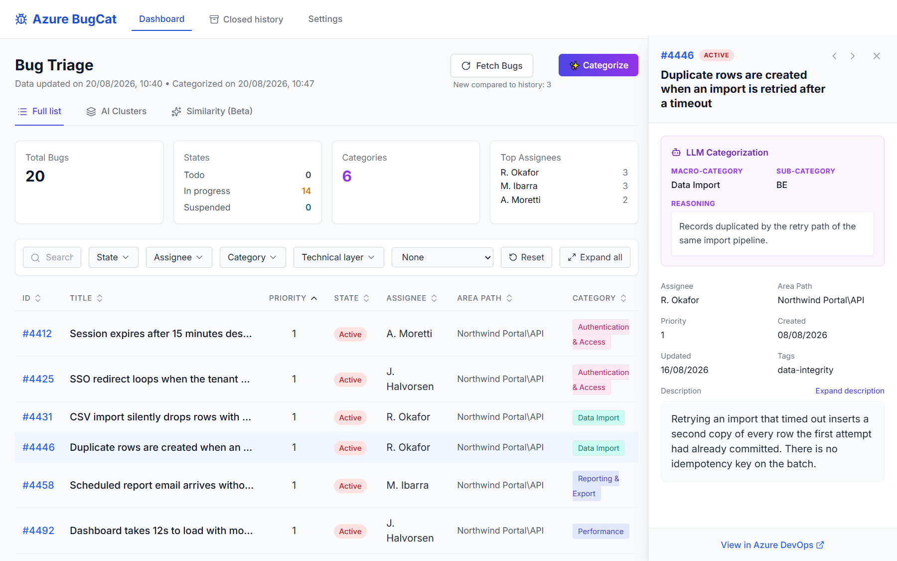
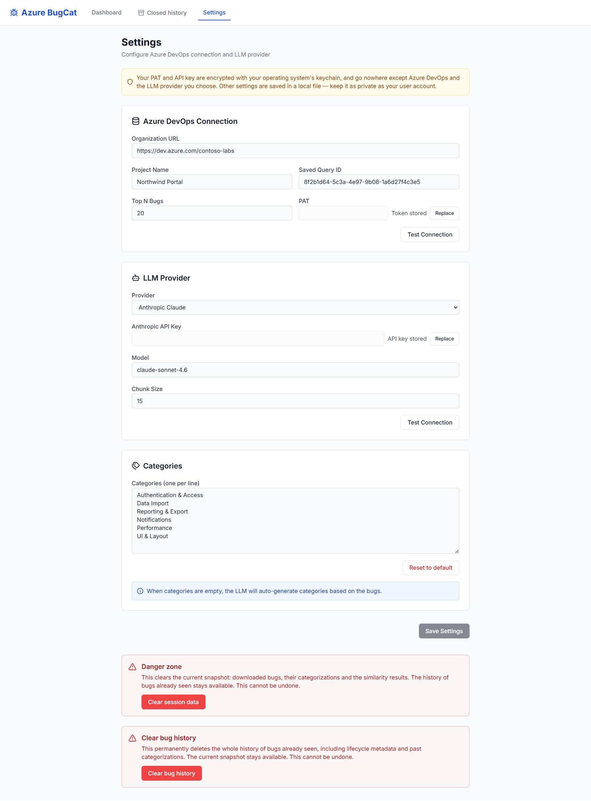
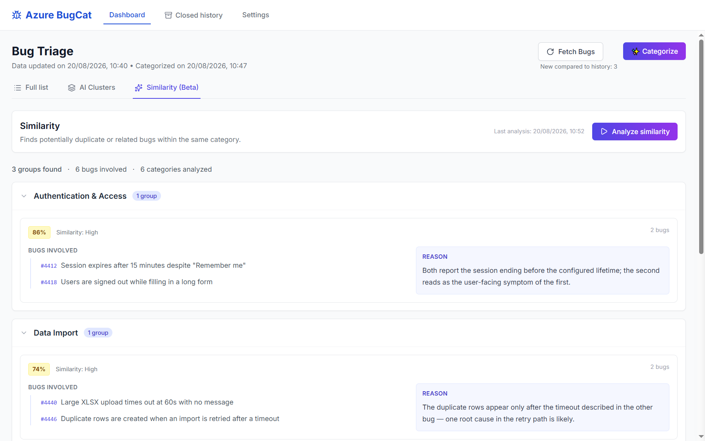
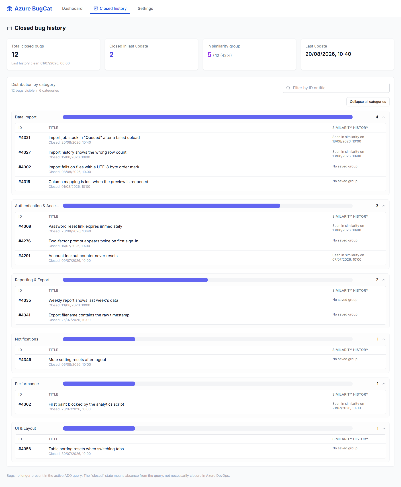

<h1 align="center">
  <picture>
    <source media="(prefers-color-scheme: dark)" srcset="docs/images/logo-dark.png">
    <source media="(prefers-color-scheme: light)" srcset="docs/images/logo-light.png">
    
  </picture>
</h1>

<p align="center">
  Turn a messy Azure DevOps bug backlog into categorized, deduplicated,<br>
  triage-ready groups — locally, with the LLM provider you choose.
</p>

<p align="center">
  <a href="LICENSE"></a>
  <a href="https://github.com/Elverle/Azure_BugCat/actions/workflows/ci.yml"></a>
  <a href="https://github.com/Elverle/Azure_BugCat/releases/latest"></a>
</p>



## About

**Azure BugCat** is a desktop app for people who own a bug backlog they did not write. It reads the bugs from a saved Azure DevOps query, asks an LLM to sort them into categories, then makes a second pass to find the ones that describe the same problem twice.

Everything runs on your machine. There is no server, no account, and no backend of ours between you and the two services you already use — Azure DevOps and the LLM provider you configure.

## Features

- **Fetch from a saved query.** Point the app at an existing Azure DevOps work item query; an incremental cache re-reads only what changed since the last fetch.
- **Categorize with your own provider.** OpenAI, Anthropic, Google Gemini, OpenRouter, or any OpenAI-compatible endpoint. Each bug comes back with a macro-category, a technical layer, and a one-line reason.
- **Find the duplicates.** A second pass compares bugs inside each macro-category and groups the ones that look like the same issue.
- **Track what gets closed.** Closed bugs accumulate in a local catalog that feeds a KPI page, so the history survives even after the query stops returning them.
- **Steer the taxonomy, or don't.** Supply your own list of categories, or leave the field empty and let the model propose them.
- **Keys in the system keychain.** Wherever the operating system provides one, the Azure DevOps token and the API key are encrypted with it rather than left in a config file.

## Download & install

Grab the installer for your platform from the [latest release](https://github.com/Elverle/Azure_BugCat/releases/latest). You do not need Node.js, npm, or a checkout of this repository to run the app.

| Platform | File | Notes |
| --- | --- | --- |
| Windows | `Azure.BugCat.Setup.<version>.exe` | NSIS installer |
| macOS (Apple silicon) | `Azure.BugCat-<version>-arm64.dmg` | Open the dmg, drag the app to Applications |
| macOS (Intel) | `Azure.BugCat-<version>.dmg` | Same, for x64 machines |

### The installers are not signed

There is no Apple Developer certificate and no Windows code-signing certificate for version 1.0, so both operating systems will warn you the first time:

- **Windows** shows a SmartScreen blue box. Click *More info*, then *Run anyway*.
- **macOS** refuses to open the app on a double-click. Right-click the app, choose *Open*, then confirm.

That warning means the binary is unattributed, not that it is unsafe — but you only have our word for it, which is exactly why the workflow that builds these installers [is in the repository](.github/workflows/release.yml) and builds them from the tagged source.

### What you need to bring

- An Azure DevOps organization and project.
- A saved work item query returning the bugs you care about.
- A personal access token scoped to **Work Items · Read**. Nothing in the app writes back to Azure DevOps.
- An API key for one of the supported LLM providers. Categorizing bugs costs whatever that provider charges for the tokens.

See the [changelog](CHANGELOG.md) for what shipped in this version.

## Quickstart

1. Install the app and open it. The dashboard starts empty.
2. Go to **Settings** and fill in the **Azure DevOps Connection** section: organization URL, project name, saved query ID, and your PAT.
3. Fill in the **LLM Provider** section: pick a provider, paste the API key, and name the model you want to use.
4. Optionally list your own categories in the **Categories** box, one per line.
5. Press **Test Connection** in both sections, then **Save Settings**. A saved token stops being editable and the field reads *Token stored*; press **Replace** to swap it later.
6. Back on the dashboard, press **Fetch Bugs**, then **Categorize**. Progress is visible chunk by chunk and can be cancelled.
7. Open the **Similarity** tab and press **Analyze similarity** for the duplicate groups. The **Closed history** page holds the KPIs.



## Settings reference

| Field | Required | Example | What it does |
| --- | --- | --- | --- |
| Organization URL | Yes | `https://dev.azure.com/your-org` | The Azure DevOps organization to query |
| Project Name | Yes | `PaymentsPlatform` | The project the saved query belongs to |
| Saved Query ID | Yes | `12345678-1234-1234-1234-123456789abc` | The UUID of the query, from its URL in Azure DevOps |
| Top N Bugs | Yes | `20` | How many bugs to pull in one fetch |
| PAT | Yes | — | Personal access token, scope **Work Items · Read** |
| Provider | Yes | `openai` | One of `openai`, `anthropic`, `gemini`, `openrouter`, `generic` |
| API Key | Yes | — | Credential for the selected provider |
| Base URL | Only for `generic` | `https://api.example.com/v1` | The OpenAI-compatible endpoint to call |
| Model | Recommended | `gpt-4.1-mini` | The model used for both passes |
| Chunk Size | Yes | `15` | How many bugs go into a single request |
| Categories | Optional | one per line | Your taxonomy; empty means the model proposes its own |

## How it works

### Categorization

The app pulls up to *Top N* bugs from the saved query and sends them to the provider in chunks of *Chunk Size*. Each bug comes back with three things: a **macro-category** (the functional area), a **technical layer**, and a short **reason** explaining the assignment — so a category you disagree with is arguable rather than opaque.

Chunking is what keeps a long backlog inside the model's context window and lets the run report progress instead of blocking. It also makes cancelling cheap: every chunk is saved as it completes, so stopping a run keeps the bugs already categorized and leaves the rest untouched.

### Similarity

Similarity is a second pass, and it only compares bugs that already share a macro-category. Two bugs from different areas of the product are not candidates for being the same bug, so excluding them makes each comparison cheaper and the groups it does find more credible.



### Closed-bug history

A bug that gets closed eventually falls out of the saved query, and with it any record that it existed. The app keeps its own catalog: bugs it has seen stay there with their category, and closed ones feed a KPI page that shows what the team actually cleared over time. The catalog also means a second fetch only re-categorizes bugs that are new or have changed.



## Privacy & data

**What leaves your machine.** Two destinations, both of them yours:

- **Azure DevOps** receives the query the app runs, authenticated with your PAT.
- **Your configured LLM provider** receives the id, title, description and tags of the bugs being categorized. Nothing else, and nowhere else — there is no analytics, no telemetry, and no update ping.

**What stays local.** The bug catalog, the current session, and your settings live in the app's `userData` directory on your machine.

**How the credentials are protected.** The PAT and the API key are encrypted with the operating system's own keychain via Electron's `safeStorage` — DPAPI on Windows, Keychain on macOS, libsecret on Linux — and stored as ciphertext. If you installed an earlier version that saved them in the clear, the app re-encrypts them the next time it starts.

**What that protection is not.** The rest of the settings store is encrypted with a key file that sits next to the data itself: anyone who can copy both can read it, so treat that layer as obfuscation rather than security. And no at-rest encryption of any kind — including the keychain one — protects you from malicious code running as your own operating system user. If something is already running as you, it can ask the keychain the same way the app does.

**On Linux without a keyring.** Where no unlocked libsecret keyring is available the keychain cannot be used, and the two secrets stay exactly as previous versions stored them: inside the store file, under that same travelling key. The app checks again on every launch and encrypts them properly as soon as a keyring appears.

## Troubleshooting

Every error dialog shows one of these titles, with the underlying message below it as detail.

| What you see | What it usually means |
| --- | --- |
| **Azure DevOps authentication failed** | The PAT is wrong, expired, or lacks the *Work Items · Read* scope |
| **Azure DevOps resource not found** | The organization URL, project name, or saved query ID does not resolve — a query ID must be a UUID, not a query name |
| **The query returned no bugs** | The query works but matches nothing; check its filters in Azure DevOps |
| **Azure DevOps request timed out** | Network or a VPN in the way; retry before changing settings |
| **LLM provider authentication failed** | Wrong or revoked API key, or a key belonging to a different provider than the one selected |
| **LLM provider rate limit reached** | The provider is throttling. Lower *Chunk Size*, or wait and retry |
| **The LLM request timed out** | Usually a chunk too large for the model. Lower *Chunk Size* |
| **The LLM response could not be read** | The model answered with something that is not the expected structure — common with very small or non-instruct models. Try a stronger model |
| **Operation cancelled** | You stopped the run. Chunks that finished before you pressed cancel are kept |
| **Configuration problem** | Settings could not be read or written on disk |
| **Unexpected error** | Anything the app could not classify. The detail line is the useful part when reporting it |

Nothing helped? [Open an issue](https://github.com/Elverle/Azure_BugCat/issues) with the error title and the detail line.

## How it's built

Azure BugCat is an Electron app — React and TypeScript in the renderer, the Azure DevOps and LLM clients in the main process, and a preload bridge that is the only way across. It was built with Claude Code, spec first, and the paper trail is part of the repository rather than something that was cleaned up before publishing:

| Where | What's in it |
| --- | --- |
| [`wiki/`](wiki/) | The architectural knowledge base — components, concepts, the features as they were actually delivered, and the reasoning behind the decisions |
| [`.claude/`](.claude/) and [`.github/agents/`](.github/agents/) | The agent definitions used during development |

Some of the older pages under `wiki/` are written in Italian. The application, its tests, and everything written since are in English.

## Development

```bash
git clone https://github.com/Elverle/Azure_BugCat.git
cd Azure_BugCat
npm ci
npm run dev
```

Node.js 22 or later. Before opening a pull request, the full gate has to pass:

```bash
npm run lint && npm run typecheck && npm test && npm run build
```

To build installers locally, run `npm run package`; they land in `dist-electron/`. Each platform's installer has to be built on that platform.

## Contributing

Contributions are welcome. [`CONTRIBUTING.md`](CONTRIBUTING.md) covers the setup, the gate, the commit convention, and how the project is laid out.

## Roadmap

Deliberately left out of 1.0, in rough order of how much they would help:

- [ ] A proper application icon — the window and the installer still carry Electron's default
- [ ] Signed and notarized installers, so the first launch stops looking alarming
- [ ] Auto-update
- [ ] An English translation of the wiki pages still written in Italian
- [ ] An animated walkthrough of the fetch → categorize → deduplicate flow
- [ ] A SQLite catalog, replacing the JSON store as the history grows
- [ ] A translatable UI, so the app can speak more than English

## License

Azure BugCat is licensed under the MIT license. See [`LICENSE`](LICENSE) for the full text.
